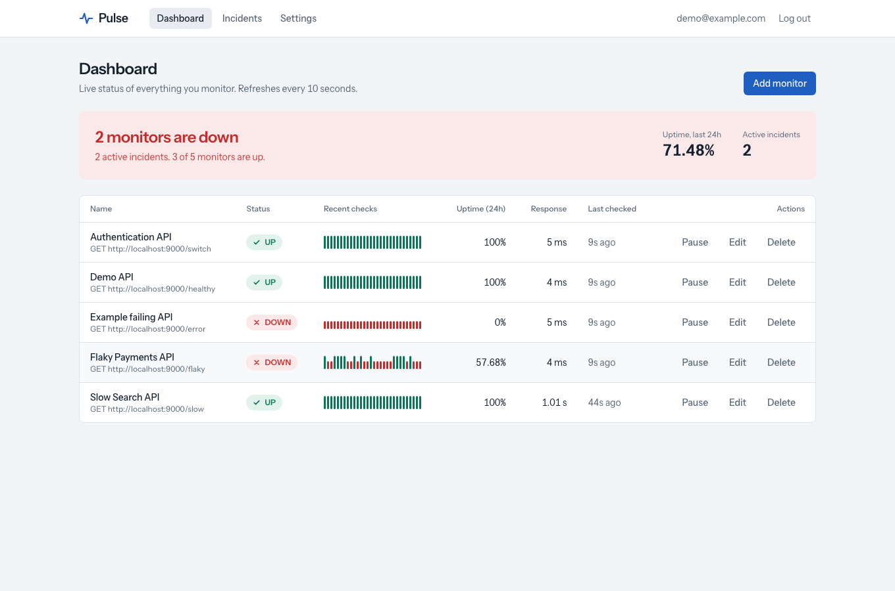
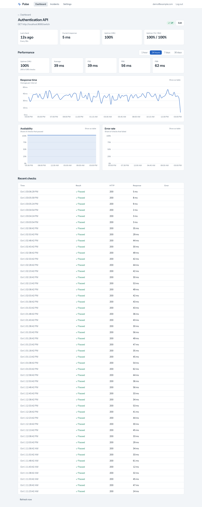
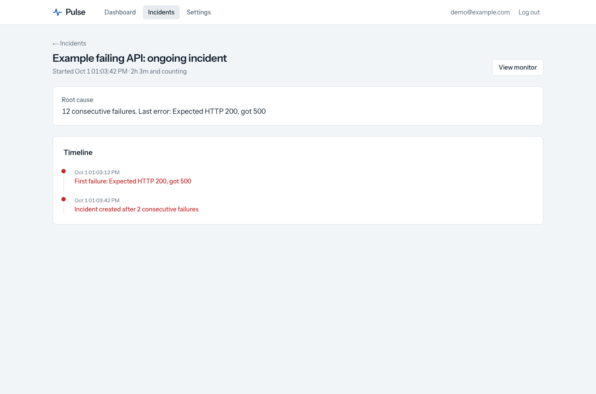

# Pulse: API monitoring & incident detection

A small-scale take on UptimeRobot / Datadog synthetic monitoring. Register an API, and distributed workers check it on a schedule, store every result, **open an incident after N consecutive failures, resolve it after M consecutive successes**, and notify you by email, webhook or Discord.



| Monitor details | Incident timeline |
|---|---|
|  |  |

## Features
- Monitors: URL, method (GET/POST/PUT/PATCH/DELETE), headers, JSON/text body, expected status, timeout, interval (30 s–24 h), response-time threshold, failure/recovery thresholds, optional immediate retries on network errors
- Pluggable response assertions (`body_contains`, `body_not_contains`, `json_field`)
- Error classification: timeout, DNS, connect, invalid response, unexpected status, HTTP error, assertion failed, slow, blocked target
- Incident engine: pure state machine, DB-enforced deduplication, full timeline
- Notifications with retry/backoff: email (SMTP), generic webhook, Discord
- Dashboard (UP / DOWN / PAUSED with icons, heartbeat strips), monitor page (1 h/24 h/7 d/30 d charts: response time, time-weighted availability, errors by cause; avg/P50/P95/P99; 24 h/7 d/30 d uptime and downtime), incidents page, settings
- Account settings: change email/password (re-authenticated; a password change signs out other sessions) and delete account; settings organised into Account / Notifications / Status page / API keys
- Public status page, API keys (hashed, shown once, revocable)
- Security: Argon2, HttpOnly cookies, tenant isolation, **SSRF protection with DNS-rebinding defence**, rate limiting, security headers, request limits
- Observability: structured JSON logs, Prometheus metrics, `/health`, `/ready`

## Architecture
See [docs/ARCHITECTURE.md](docs/ARCHITECTURE.md): service layout, scheduling, incident state machine, failure handling, and the design rationale (why Redis/Celery/Postgres, how incidents are deduplicated, how SSRF/tenancy/retries work).

```
Next.js ─► FastAPI ─► PostgreSQL        Celery Beat ─► Redis queue ─► Celery workers ─► your APIs
                                                                         └─► incident engine ─► notifications
```
The API never runs checks; Beat only enqueues; workers do the work.

## Tech stack
Next.js 16 · React 19 · TypeScript · Tailwind 4 · Recharts │ Python 3.12 · FastAPI · Pydantic · SQLAlchemy 2 · Alembic │ PostgreSQL 16 · Redis 7 · Celery │ Docker Compose · GitHub Actions │ pytest · Vitest + Testing Library · Playwright

## Quick start (Docker)
```bash
git clone <repository> && cd api-monitoring-incident-detection
cp .env.example .env
docker compose up --build        # or: make dev
```
| URL | What |
|---|---|
| http://localhost:3000 | App (log in with the seeded `demo@example.com` / `demo-password-123`, or register) |
| http://localhost:8000/docs | API docs |
| http://localhost:8025 | Mailpit: catches alert emails |
| http://localhost:9000 | Demo target API with a fail/restore switch |

Startup order is handled by Compose: Postgres + Redis (healthchecks) → `migrate` (Alembic + seed) → API, worker, scheduler → frontend.

### Walk-through (the demo)
1. Open the app and log in as the demo user. Charts are pre-populated from seeded history.
2. **Add monitor** → URL `http://demo-service:9000/switch`, check every 30 s, open incident after 2, resolve after 1.
3. Add an **email channel** in Settings (use **Send test** and watch Mailpit).
4. Open http://localhost:9000 → **Make it fail**. Within ~1 minute the monitor turns **DOWN**, an incident opens, and an email arrives.
5. **Restore**. After the next passing check the incident resolves automatically; open it for the timeline.

Other demo endpoints: `/healthy` (200), `/error` (500), `/slow` (delayed), `/flaky` (random).

## Local development without Docker
Requires Python 3.12+, Node 22+, PostgreSQL, Redis.
```bash
createdb monitor && createdb monitor_test
cd backend && python -m venv .venv && .venv/bin/pip install -r requirements-dev.txt
export DATABASE_URL=postgresql+psycopg://$USER@localhost/monitor PYTHONPATH=.:..
.venv/bin/alembic upgrade head
.venv/bin/uvicorn app.main:app --reload                                        # API :8000
.venv/bin/celery -A worker.celery_app worker -P threads -Q checks,notifications # worker
.venv/bin/celery -A worker.celery_app beat                                     # scheduler
cd ../frontend && npm ci && npm run dev                                        # UI :3000 (proxies /api → :8000)
```
To monitor something on your own machine, set `SSRF_ALLOWED_HOSTS=localhost` (dev only; see Security).

## Configuration
All via environment (see `.env.example`):

| Variable | Purpose |
|---|---|
| `DATABASE_URL`, `REDIS_URL` | connections |
| `SECRET_KEY` | JWT signing key, ≥32 chars. **Generate your own** |
| `ACCESS_TOKEN_MINUTES`, `COOKIE_SECURE` | session lifetime; set `COOKIE_SECURE=true` over HTTPS |
| `CORS_ORIGINS`, `INTERNAL_API_URL` | allowed origins; where Next.js proxies `/api` |
| `SSRF_ALLOWED_HOSTS` | **dev only** hostnames exempt from private-IP blocking |
| `SMTP_*` | email delivery |
| `RATE_LIMIT_PER_MINUTE`, `AUTH_RATE_LIMIT_PER_MINUTE`, `TRUST_PROXY_HEADERS` | rate limiting |
| `CHECK_RETENTION_DAYS` | result retention (default 35) |
| `SEED_DEMO_DATA` | seed on first start |

## Database migrations
```bash
make migrate                         # docker
cd backend && alembic upgrade head   # local
alembic revision --autogenerate -m "describe change"
```
CI applies, rolls back and re-applies all migrations.

## Testing
```bash
make test            # backend + frontend unit/integration
make e2e             # Playwright against the running stack
make lint            # ruff, mypy, eslint, tsc
```
- **Backend (194 tests):** unit (state machine, SSRF, assertions, retry), time-weighted metrics on exact timelines (DST, gaps, pauses), API (auth, validation, CRUD, tenant isolation, rate limiting, headers, size limits, status page, API keys), integration against real Postgres/Redis and a real local HTTP target (checker, incident lifecycle, 4-thread race → one incident, scheduler incl. broker outage, notification retry/failure, Redis-outage recovery), and an API-level end-to-end lifecycle test.
- **Frontend (32 tests):** formatting, form parsing, status, heartbeat, banner, timeline, dialog, buttons, toggle, segmented control, copy button and toast components.
- **Browser E2E (2 specs):** an account flow (change password signs out a second browser, change email, delete account) and the lifecycle flow: register → create monitor → fail demo API → incident → restore → resolved, driven through the UI.

Backend tests need Postgres database `monitor_test` and Redis (`TEST_DATABASE_URL`, `REDIS_URL` override the defaults).

## Security
Full detail in [docs/SECURITY.md](docs/SECURITY.md). Highlights: Argon2id; HttpOnly SameSite cookie or hashed API keys; every query scoped to the owner (foreign IDs → 404); **SSRF**: blocked schemes, localhost, private/loopback/link-local/metadata/CGNAT ranges, IPv6-mapped forms, validated at creation *and* at connect time against the exact IP used (DNS-rebinding safe), redirects never followed; rate limiting, CORS allow-list, size limits, security headers, log redaction.

## API
See [docs/API.md](docs/API.md) or `/docs` on the running API.

## Project layout
```
backend/   FastAPI app (api, core, models, schemas, services, repositories), Alembic, tests
worker/    Celery app, check/notify tasks, HTTP checker, scheduler tasks
frontend/  Next.js app, components, hooks, unit + e2e tests
demo-service/  target API with a fail switch
infrastructure/  Dockerfiles, Prometheus config
docs/      ARCHITECTURE, SECURITY, API, screenshots
```

## Known limitations & future work
Verified: backend, worker, scheduler, frontend and the browser E2E were run end-to-end natively against real Postgres and Redis. The Docker images/Compose file are validated with `docker compose config` and built in CI, but were not started on the author's machine, since the Docker daemon was unavailable. No email verification, password reset or MFA yet. Single region.

Future: multi-region probes · Kubernetes · OpenTelemetry tracing · Grafana dashboards · maintenance windows · multi-step synthetic workflows · browser checks · teams/RBAC/SSO · alert routing and escalation policies · anomaly detection · AI incident summaries · JWT revocation, encrypted secrets at rest.
